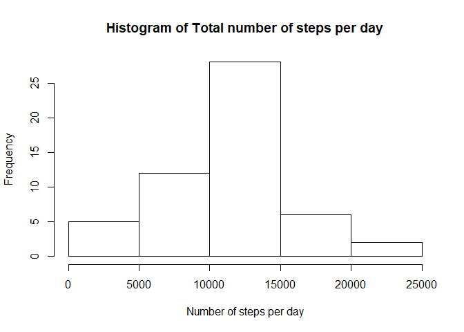
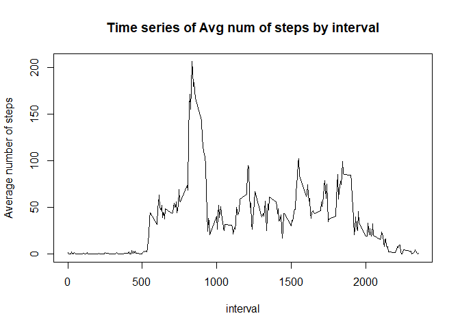
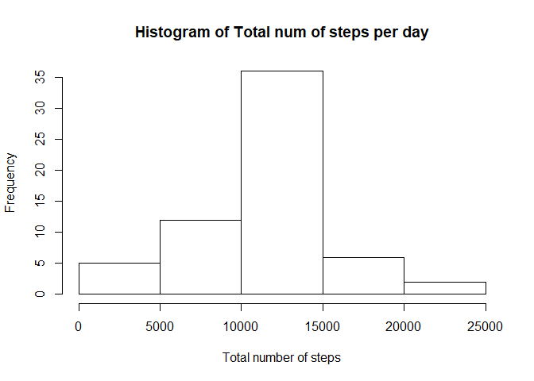
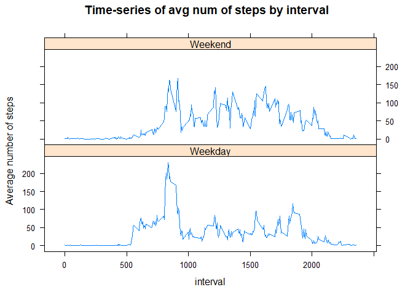

## Loading and preprocessing the data
We will first check if the file "activity.csv" exists and if not will unzip the file
activity.zip in the repository. (Note: you have to set the working directory as the location of your git repository).  
We will next read the input file and remove any rows with NA values from the data.


```r
library(dplyr)
```

```
## 
## Attaching package: 'dplyr'
```

```
## The following objects are masked from 'package:stats':
## 
##     filter, lag
```

```
## The following objects are masked from 'package:base':
## 
##     intersect, setdiff, setequal, union
```

```r
setwd("~/DataScience/RepData_PeerAssessment1")
      
if (!file.exists('data')){
        dir.create('data')
}
if (!file.exists('.\\data\\activity.csv')) {
        ## Download the zip file and unzip into "data" folder        
download.file("https://d396qusza40orc.cloudfront.net/repdata%2Fdata%2Factivity.zip", 
                      'repdata_Fdata_Factivity.zip')
        unzip('repdata_Fdata_Factivity.zip',exdir = '.\\data')
}

input_data <- read.csv('.\\data\\activity.csv')
input_clean <- subset(input_data, !is.na(input_data$steps))
```


## What is mean total number of steps taken per day?
Next we will sum the total number of steps on each day and plot a histogram of the data.


```r
sum_steps <- with(input_clean,tapply(steps,date,sum,na.rm = TRUE))
hist(sum_steps, xlab = "Number of steps per day", main = "Histogram of Total number of steps per day")
```

<!-- -->

Next we will calculate the mean and median of the total number of steps taken per day

```r
mean(sum_steps, na.rm = TRUE)
```

```
## [1] 10766.19
```

```r
median(sum_steps, na.rm = TRUE)
```

```
## [1] 10765
```

## What is the average daily activity pattern?
1. Make a time series plot (i.e. type = "l") of the 5-minute interval (x-axis) and the average number of steps taken, averaged across all days (y-axis)

```r
mean_steps <- with(input_clean,tapply(steps,interval,mean,na.rm = TRUE))
df_mean <- as.data.frame(mean_steps)
rm(mean_steps)

tbl_mean <- as_tibble(df_mean)

tbl_mean <- mutate(tbl_mean,interval=as.integer(row.names(df_mean)))
```

```
## Warning: package 'bindrcpp' was built under R version 3.4.4
```

```r
plot(mean_steps ~ interval, tbl_mean, type = "l", ylab = "Average number of steps", main = "Time series of Avg num of steps by interval")
```

<!-- -->

2. Calculate which 5-minute interval, on average across all the days in the dataset, contains the maximum number of steps?

```r
max_mean <- max(tbl_mean$mean_steps, na.rm = TRUE)
max_mean
```

```
## [1] 206.1698
```

```r
tbl_max <- subset(tbl_mean, mean_steps == max_mean)
tbl_max[,2]
```

```
## # A tibble: 1 x 1
##   interval
##      <int>
## 1      835
```
The interval between 830 and 835 minutes produced the max mean steps (206) per interval across all days. 

## Inputing missing values

1. Calculate and report the total number of missing values in the dataset (i.e. the total number of rows with NA)

```r
sum(is.na(input_data$steps))
```

```
## [1] 2304
```
2. For filling in all of the missing values in the dataset, we will first identify/subset all the rows with missing values and replace the missing values with the mean for that interval and add it back to the original data

```r
input_NA <- subset(input_data, is.na(input_data$steps))
merged_data <- merge(input_NA,tbl_mean,by = "interval", all.x = T)
merged_tbl <- as_tibble(merged_data)
merged_tbl <- merged_tbl %>% select(steps = mean_steps,date,interval)
```
3. Create a new dataset that is equal to the original dataset but with the missing data filled in.

```r
input_final <- rbind(input_clean,merged_tbl)
final_tbl <- as_tibble(input_final)
final_tbl <- final_tbl %>% arrange(date,interval)
```

4. Make a histogram of the total number of steps taken each day and Calculate and report the mean and median total number of steps taken per day. 

```r
sum_step2 <- with(final_tbl,tapply(steps,date,sum,na.rm = TRUE))
hist(sum_step2, xlab = "Total number of steps", main = "Histogram of Total num of steps per day")
```

<!-- -->

```r
mean(sum_step2, na.rm = TRUE)
```

```
## [1] 10766.19
```

```r
median(sum_step2, na.rm = TRUE)
```

```
## [1] 10766.19
```

The median is slightly higher than before as we have more data after replacing the missign values. 

## Are there differences in activity patterns between weekdays and weekends?
1. Create a new factor variable in the dataset with two levels - "weekday" and "weekend" indicating whether a given date is a weekday or weekend day.

```r
final_tbl <- final_tbl %>% mutate(weekday = weekdays(as.Date(date)) ) %>% mutate(day = factor(weekday %in% c("Monday","Tuesday","Wednesday","Thursday","Friday"), levels = c(FALSE,TRUE), labels = c('Weekend','Weekday')))
levels(final_tbl$day)
```

```
## [1] "Weekend" "Weekday"
```
2. Make a panel plot containing a time series plot (i.e. type = "l") of the 5-minute interval (x-axis) and the average number of steps taken, averaged across all weekday days or weekend days (y-axis).

```r
weekday_tbl <- final_tbl %>% filter(day == 'Weekday') 
mean_list1 <- with(weekday_tbl,tapply(steps, interval, mean, na.rm=TRUE))
df_mean1 <- as.data.frame(mean_list1)
rm(mean_list1)

tbl_mean1 <- as_tibble(df_mean1)

tbl_mean1 <- tbl_mean1 %>% mutate(interval=as.integer(row.names(df_mean1))) %>%
                           mutate(day = c('Weekday')) %>%
                           rename(mean_list = mean_list1)


weekend_tbl  <- final_tbl %>% filter(day == 'Weekend') 
mean_list2 <- with(weekend_tbl,tapply(steps, interval, mean, na.rm=TRUE))
df_mean2 <- as.data.frame(mean_list2)

rm(mean_list2)

tbl_mean2 <- as_tibble(df_mean2)

tbl_mean2 <- tbl_mean2 %>% mutate(interval=as.integer(row.names(df_mean1))) %>%
                mutate(day = c('Weekend')) %>%
                rename(mean_list = mean_list2)
tbl_mean <- rbind(tbl_mean1,tbl_mean2)
tbl_mean$day <- factor(tbl_mean$day)

library(lattice)
xyplot(mean_list ~ interval|day, tbl_mean, type = "l", xlab = "interval" , ylab = "Average number of steps", layout = c(1,2), main = "Time-series of avg num of steps by interval")
```

<!-- -->
